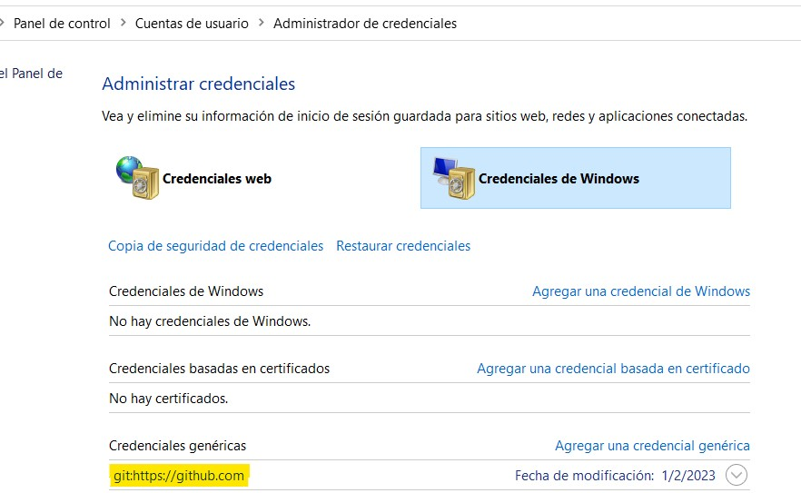

# Práctica de laboratorio: A Quemar Esas Grasitas

**ATENCIÓN:** Esta práctica no será corregida. Más allá del feedback que puedan tener durante la clase, el objetivo es que vean luego los videos con las puestas en común donde se discuten posibles soluciones para cada punto, para que puedan comparar con la solución a la que llegaron.

 > :exclamation: Para trabajar con este repositorio, usando el protocolo HTTPS, git te va a pedir un usuario y contraseña. Tené en cuenta que como contraseña tenés que usar un **token personal** generado desde GitHub, **no tu contraseña de GitHub**.
 >
 > Incluso si ya creaste uno anteriormente para otros trabajos, se recomienda crear uno nuevo para trabajar en el laboratorio que puedas eliminar más tarde desde tu cuenta de GitHub sin problemas.
 >
 > Podés crear el token desde [acá](https://github.com/settings/tokens/new). Procurá marcar la opción **repo** para que el token tenga permisos de lectura y escritura.

## Primeros pasos antes de arrancar :hatching_chick:

1. Para iniciar la práctica grupal trabajando con git, cada integrante del grupo deberá **clonar** este repositorio, con el comando:

    `git clone urlParaClonarElRepo`.

    > :warning: Si al ejecutar el comando para clonar el repositorio **no te preguntó tu usuario y contraseña**, y directamente **falló** indicando que el repositorio no fue encontrado, revisá que no haya una **credencial ajena** de GitHub guardada en el administrador de credenciales de windows.
    >
    > 
    >
    > Si encontrás una, borrala con la opción **Quitar**, y volvé a intentar clonar el repositorio.

2. Una vez que hayan clonado el repositorio exitosamente, asegúrense de abrir el VSCode sobre la carpeta raíz del proyecto.

    > La forma más cómoda de hacer esto desde la misma consola usada para clonar el repositorio (sin hacer más nada luego de clonarlo), es ejecutar: `code ./practica-funcional-2023-gimnasio-NOMBREDETUGRUPO` 
    >
    > De acá en más les recomentamos usar una terminal integrada del VSCode, que se abrirá automáticamente en el lugar correcto para que todo funcione para ejecutar comandos de git y stack.

## Modalidad de trabajo :clipboard::lab_coat:

Este proyecto cuenta con 2 archivos relevantes (además del `README.md` que estás viendo):
  - `src/Library.hs`: acá van las definiciones de funciones y tipos de datos que se piden para resolver la consigna.
  - `test/Spec.hs`: acá se definen las pruebas automáticas.

Cada vez que estén por empezar un punto, **leanlo completo** para entender bien lo que se busca lograr. Luego avancen de a poco, **testeando** a medida que trabajan sobre la solución, no dejen las pruebas para el final.

Recuerden **ir subiendo sus cambios** en la medida en la que tengan pequeñas unidades de solución que funcionen como esperaban.

Pueden subir su solución a GitHub con los comandos:
- `git add .` y `git commit -m "Mensaje que explica los cambios"` para versionar todos sus cambios
  > 💡 Alternativamente se pueden combinar ambas operaciones con el comando: `git commit -am "Mensaje que explica los cambios"`. La opción `-am` indica que se desean agregar los cambios sobre todos los archivos modificados al commit, además de indicar el mensaje a usar.
- `git push` para subir esos cambios a GitHub

Es importante hacer **commits chicos** y **subir los cambios frecuentemente** así todo el equipo tendrá acceso al trabajo realizado por el resto.

Cada integrante podrá **actualizar su repo local** con los cambios más recientes que se hayan subido a GitHub con el comando `git pull`, lo cual incorporará todo lo que se haya subido y que no tengan en su copia del repositorio.

> ⚠️ **IMPORTANTE!** ⚠️ Dado que van a estar trabajando al mismo tiempo en varias máquinas, **asegúrense de usar el comando `git pull` luego de commitear y antes de pushear**. En caso de que ocurra un **conflicto** que git no resuelva automáticamente y no sepan cómo resolverlo, avisen al equipo docente para que les de una mano.

### Resumen para el flujo de trabajo:
1. Antes de hacer nuevos cambios, para asegurar tener el repo local actualizado: `git pull`
2. Luego de hacer cambios que están en condiciones de compartir con su equipo: `git commit -am "Mensaje que explica los cambios"`
3. Antes de intentar subir esos cambios: `git pull`
4. Finalmente subir a GitHub: `git push`
5. Cuando estén por empezar con nuevos cambios, volver al paso 1, por si alguien más subió algo desde la última vez que actualizaron su repo local.

## Pruebas manuales y automáticas :white_check_mark:

Para probar el programa manualmente (desde la consola de Haskell) corré el comando: `stack ghci`. Para correr las pruebas automáticas corré el comando: `stack test`.

> ⚠️ Para probar el programa, ya sea manualmente o con las pruebas automáticas, el proyecto **tiene que compilar**. Los problemas de compilación, si los hay, los va a marcar el VSCode tanto en el editor como en la vista de **Problemas**.

### Testeo automático

Esta práctica es más abierta y les da lugar para definir sus propias pruebas automáticas en base a lo que sería esperable que pase al usar las funciones que definan de acuerdo a la consigna.

Además para los primeros puntos ya les proponemos qué testear, lo cual se indica en el título del test correspondiente.

Por ejemplo, si hubiera un test de este estilo:

```haskell
  it "Sumar 2 y 8 debería dar 10" $ do
    -- Cambiar esto por la consulta y el valor esperado real
    True `shouldBe` False
```

Se podría cambiar por algo así para validar lo que se pide:

```haskell
  it "Sumar 2 y 8 debería dar 10" $ do
    2 + 8 `shouldBe` 10
```

> Para más información sobre testing podés ver después de clase el [video de Fer Dodino sobre HSpec](https://www.youtube.com/watch?v=I3pJnW680Gw), y cómo se usan estas herramientas para desarrollar a partir de las pruebas automáticas (metodología de desarrollo conocida como TDD).

# Enunciado

Se desea desarrollar un sistema para un popular gimnasio que permita predecir el efecto de los ejercicios que realizarían sus socios con las máquinas que dispone. Las máquinas tienen ciertos ejercicios de fábrica (algunos son customizables), los cuales pueden realizarse durante una cantidad de minutos determinada, y sirven para tonificar músculos y/o quemar calorías.

De cada gimnasta nos interesa saber su **edad**, su **peso** y su coeficiente de **tonificación**.

> :warning: Para simplificar, representaremos esos valores con números enteros, por ese motivo cuando sea necesario hacer divisiones usaremos división entera `div`, para evitar problemas de tipos que no son relevantes a esta práctica.

Los ejercicios que se pueden hacer en el gimnasio **los modelaremos con funciones** que dada una **cantidad de minutos** y un **gimnasta**, retorna al **gimnasta** luego de realizar dicho ejercicio.

Un ejemplo simple de ejercicio en el cual el gimnasta no hace nada (y por ende queda igual que al principio sin importar cuánto tiempo lo realice) podría ser:

```haskell
relax minutos gimnasta = gimnasta
```

## Precalentamiento :hotsprings:

Resolver los siguientes puntos repartiendo el trabajo entre computadoras diferentes. El objetivo es que practiquen la mecánica de subir y bajar cambios con git mientras dan estos primeros pasos.

>  :bulb: Tengan en cuenta que el 2a y el 2b dependen del 1, el pero 2a y el 2b pueden resolverse en paralelo.

1. En el archivo `src/Library.hs` declarar el tipo de dato `Gimnasta` como crean conveniente.

    > :warning: Tengan en cuenta que debe ser posible comparar dos gimnastas por igualdad (typeclass `Eq`) para las validaciones de las pruebas automáticas y vamos a querer que puedan mostrarse (typeclass `Show`) para poder ver los resultados al hacer pruebas en la consola.

2. Una vez que exista el tipo de dato `Gimnasta`...

    a. Explicitar el tipo de la función `relax`.

    b. Declarar una constante `gimnastaDePrueba` para poder probar el programa, pueden crearlo con los valores que más les gusten ya que no serán relevantes.

### Testing :white_check_mark:

Recuerden que, luego de completar esta parte del ejercicio, el proyecto debería compilar y también debería dar verde la prueba de la sección **Precalentamiento**, donde se usa la función `relax` con el `gimnastaDePrueba` al correr `stack test`.

## Punto 1: Gimnastas saludables :ok_hand:

Necesitamos saber si alguien está saludable, lo cual se cumple si no es obeso y tiene una tonificación mayor a 5. Alguien es obeso si pesa más de 100 kilos.

En el archivo `src/Library.hs` definir las funciones para saber **si alguien es obeso** y **si alguien está saludable**.

> :bulb: Para repartirse el trabajo de este punto, incluyendo las pruebas automáticas a desarrollar, pueden subir un primer commit que sólo incluya el tipo de las 2 funciones a desarrollar, y una definición incompleta de cada función a modo de "placeholder", usando `undefined` en el cuerpo de la función.
>
> De esa forma, luego de que todo el equipo haga `git pull` para incorporar esos cambios, pueden avanzar con el desarrollo en paralelo de las funciones y pruebas que dependen de lo anterior y el proyecto compile, a pesar de no estar 100% resuelto.

### Testing :white_check_mark:

En el archivo `test/Spec.hs` escribir las consultas para probar la solución y los resultados esperados de acuerdo al nombre de cada test, como se explica más arriba en la sección **Pruebas manuales y automáticas -> Testeo automático**.

> :bulb: Dado que cada gimnasta a usar para las pruebas tiene que cumplir con condiciones distintas de las demás, lo más conveniente es crear el gimnasta directamente en el test, en vez de declarar una constante particular como hicieron con `gimnastaDePrueba` para el primer test que ya venía definido.
>
> Lo mismo aplica para los puntos siguientes. Les va a simplificar mucho pensar las pruebas de forma independiente, sin tener que recordar detalles sobre datos de prueba que armaron para otro próposito.

## Punto 2: Quemar calorías :sweat_drops:

Hacer que una función para que un gimnasta queme una cantidad de calorías, y en consecuencia, que baje de peso.

* Si el gimnasta es obeso, baja 1 kilo cada 150 calorías quemadas.
* Si no es obeso pero tiene más de 30 años y las calorías quemadas son más de 200, baja siempre un kilo.
* En cualquier otro caso se baja la cantidad de calorías quemadas dividido por el producto entre el peso y la edad del gimnasta.

### Testing :white_check_mark:

En el archivo `test/Spec.hs` escribir los tests que crean convenientes para este punto, dentro de un nuevo describe con título `"Punto 2: Quemar calorías"`.

> Para pensar :thought_balloon: 쯖uántos casos de prueba podrían ser necesarios para validar todos los caminos posibles?

## Punto 3: Ejercicios :bicyclist:

Ahora sí, a quemar esas grasitas!

Desarrollar las funciones `pesas`, `caminataEnCinta`, `entrenamientoEnCinta`, `colina` y `montania` sabiendo que queremos usarlas para que un gimnasta ejercite. Más abajo se explica qué se espera de cada una de ellas.

> :bulb: Recuerden de qué tipo se supone que son los ejercicios en general. En caso de que alguna de las funciones que se piden requiera más información, pueden tener más parámetros.
>
> En ese caso, es preferible que esos parámetros adicionales los reciban primero. Más adelante explicaremos mejor el por qué :wink:

Al igual que para el punto anterior, en el archivo `test/Spec.hs` definan los tests que crean convenientes para este punto, definiendo un nuevo describe con título `"Punto 3: Ejercicios"`.

> :warning: Sobre todo para este punto, no dejen los tests para el final, acompañen el desarrollo con las pruebas. El desarrollo de software es un proceso iterativo. Si sólo hacen una iteración, todo se vuelve cuesta arriba :sweat_smile:

### Levantar pesas  :muscle:

Las **pesas** incrementan la tonificación del gimnasta en la décima parte de los kilos a levantar si el ejercicio se realiza por más de 10 minutos, sino nada.

> :bulb: Asegúrense de abstraer aquellas ideas de dominio que tengan sentido por sí mismas y puedan reutilizarse en otros contextos.

### Escalar :mount_fuji:

La **colina** quema 2 calorías por minuto multiplicado por la inclinación de la colina.

La **montaña** son 2 colinas sucesivas (cada una con la mitad de duración respecto de los minutos totales indicados), donde la segunda colina tiene una inclinación de 3 más que la inclinación inicial elegida. Además de hacer perder peso por las calorías quemadas por las colinas, este ejercicio incrementa en una unidad la tonificación del gimnasta.

> :muscle: Desafío! La montaña, al ser una secuencia clara de operaciones, puede pensarse como una composición de funciones. Traten de pensarla en esos términos.

### Ejercicios en cinta  :running:

Cualquier ejercicio que se haga en una cinta quema calorías en función de la velocidad promedio alcanzada durante el ejercicio, quemando 1 caloría por la velocidad promedio por minuto.

* La **caminata** es un ejercicio en cinta con velocidad constante de 5 km/h.
* El **entrenamiento en cinta** arranca en 6 km/h y cada 5 minutos incrementa la velocidad en 1 km/h, con lo cual la velocidad máxima dependerá de los minutos de entrenamiento.

> :muscle: Desafío! Hay muchas similitudes entre la caminata y el entrenamiento, porque ambos se basan en ejercitar en la cinta. Traten de pensar una abstracción más general para representar al ejercicio en cinta, y definir los dos ejercicios concretos pedidos en términos de esa otra idea.

# Puestas en común

- Puesta en común #1: En [este video](https://www.youtube.com/watch?v=wRygZMNpH0E) se explica la primer parte de esta práctica, incluyendo algunas variantes para encarar el punto 1.
- Puesta en común #2: En [este video](https://www.youtube.com/watch?v=LApMSiF_fO8) se presenta una posible solución para los puntos 2 y 3.
